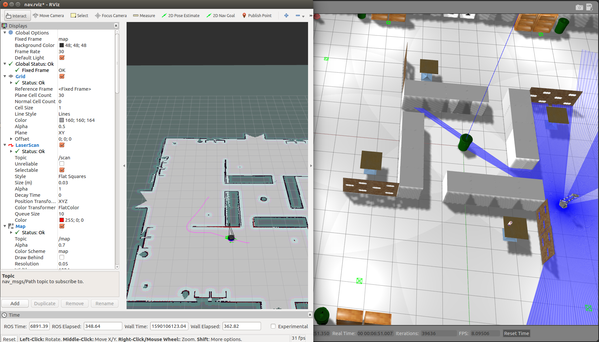

## 墨玉机器人系统-后端 `catkin_ws` 源码安装和使用说明


### 源码安装方法

在已经安装好 `ROS-Kinetic` 的计算机上，首先克隆或下载本仓库到本地，然后将本仓库下的 `Team201_catkin_ws` 复制到根目录下，使用以下命令进入并编译 `ros` 工作空间：

```shell
cd ~/Team201_catkin_ws
catkin_make
```


编译成功后命令行显示以下的[100%]反馈，并发现 `~/Team201_catkin_ws` 目录下多出了 `build` 和 `devel` 文件夹。此时需要将 `catkin_ws` 刷新写入 `~/.bashrc` 文件：

```shell
echo 'source ~/Team201_catkin_ws/devel/setup.bash' >> ~/.bashrc
```


### 启用仿真环境的启智ROS机器人及键盘控制移动

使用以下命令启用仿真环境中的启智ROS机器人：

```
roslaunch wpr_simulation wpb_simple.launch
```


使用以下命令开启键盘控制机器人移动，注意需要保证运行键盘控制时该命令行窗口在最上方才可以发布指令：

```shell
rosrun wpr_simulation keyboard_vel_ctrl
```


### 启用仿真环境中的 `SLAM` 建图

分别在三个命令行窗口使用以下三个命令，启用仿真环境中的启智ROS机器人、启动 `SLAM` 建图以及启动键盘控制：

```
roslaunch wpr_simulation wpb_simple.launch
```

```shell
roslaunch wpb_home_tutorials hector_mapping.launch
```

```shell
rosrun wpr_simulation keyboard_vel_ctrl
```


可以观察 `RVIZ` 中地图构建的现象，使用键盘移动仿真环境中的小车，直到地图构建完善。


### 仿真环境中的定位导航

分别在两个命令行窗口使用以下两个命令，启用仿真环境中的启智ROS机器人、启动定位导航：

```
roslaunch wpr_simulation wpb_simple.launch
```

```shell
roslaunch wpb_home_tutorials nav.launch
```

先使用 `RVIZ` 上方的 `2D Pose Estimate` 对地图中的机器人定位，使激光雷达扫描的红色粒子贴合地图上的边缘，然后使用 `2D Nav Goal` 指定导航目的地，仿真环境中的机器人会自动运动到相应位置：




### 仿真环境中的桌面物品检测

使用以下命令启用仿真环境中的启智ROS机器人，然后使用导航或键盘控制的方法将机器人移动到仿真环境中的桌面前方，正对桌面

```
roslaunch wpr_simulation wpb_simple.launch
```

使用以下命令查看机器人 `Kinect` 相机中的画面，保证桌面和物品在机器人视野范围内：


然后使用以下命令检测桌面物品，`RVIZ` 中会框出检测到的桌面物品：

```shell
roslaunch wpb_home_tutorials obj_detect.launch
```

